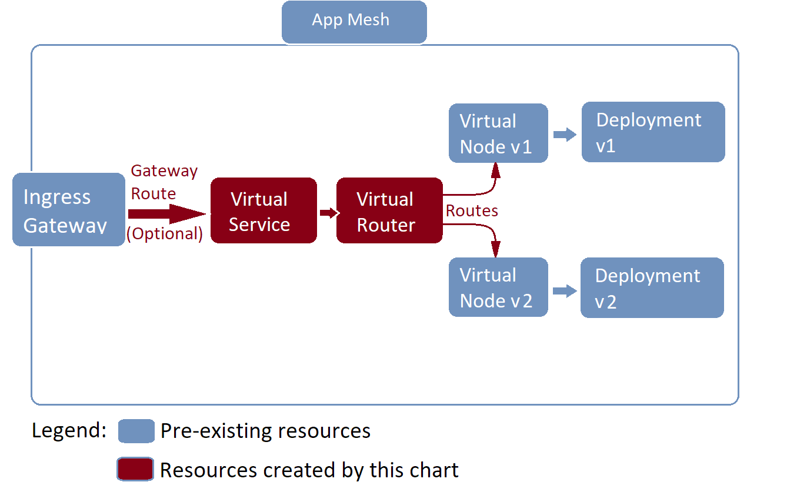

# Canary Helm Chart for AWS App Mesh on EKS Cluster

When two or more Kubernetes Deployments representing different version of the same application are deployed to an EKS cluster with [AWS App Mesh](https://docs.aws.amazon.com/app-mesh/latest/userguide/what-is-app-mesh.html), then mesh resources comprising Canary traffic pattern should be implemented as a separate Helm chart because Canary resource set has different - more permanent - lifecycle, compared to back-end services that are likely to be deployed frequently.

This project contains work-in-progress Helm Chart for building Canary App Mesh resources:
- Optional Gateway Route, which could be used to ingress traffic from outside the mesh, using pre-provisioned Ingress Gateway.
- Virtual Service - a stable/immutable/version-agnostic Canary "alias" endpoint receiving traffic from other meshed applications or from an Ingress Gateway.
- Virtual Router - taking traffic from the Virtual Service and sending it down to multiple pre-provisioned Virtual Nodes representing Pods in each app version's Deployment.

Following resources must be pre-provisioned in an EKS cluster prior to creating Canary resources:
- App Mesh (App Mesh Controller)
- At least one back-end application Deployment with a Virtual Node.
- Optionally, Ingress Gateway if the back-end app needs to take from outside the mesh.

Here's the diagram showing both resources that are expected to already exist, as well as resources deployed by this Chart:

This Helm Chart [let users specify](./charts/canary/values.yaml) names of new resources, as well as names of destination Virtual Nodes.